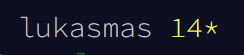

# Advent of Code 2023

https://adventofcode.com/2023

Here are my solutions to the challenges.

## Solved changes



- https://adventofcode.com/2023/day/1
- https://adventofcode.com/2023/day/2
- https://adventofcode.com/2023/day/3
- https://adventofcode.com/2023/day/4
- https://adventofcode.com/2023/day/5
- https://adventofcode.com/2023/day/6
- https://adventofcode.com/2023/day/7
- https://adventofcode.com/2023/day/8

## Compiling and running

Each day there is a different program in the saparete directory.
To compile it, follow these steps:

```
cd day'X'
mkdir build && cd build
cmake ..
make
./day'X'
```

**X** represents a day number

##### Note:

> At the moment I am concentrating on solving the puzzles and getting all 50 stars needed to complete the challenge.
> When I have more time, I will try to optimise the solutions and make it look better.
